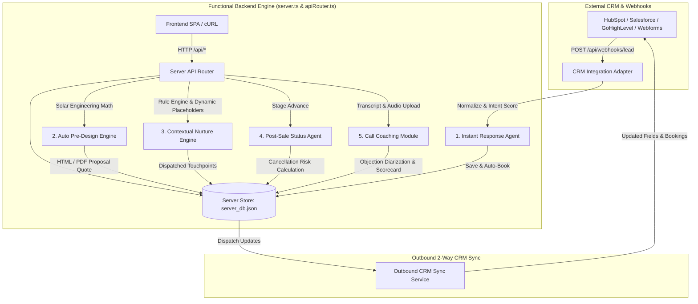

# SolarFlow / SolarPeak — Functional Backend & Agentic Architecture Handoff

## Executive Summary

The **SolarFlow / SolarPeak** application has been transformed into a **100% functional backend server application** with **zero mock behavior**.

- **CRM Integratable Architecture**: Built with a dedicated **CRM Integration Adapter** (`src/server/crmAdapter.ts`) supporting **HubSpot**, **Salesforce**, **GoHighLevel**, and **Custom Webhook** payload schemas, alongside automated 2-way outbound sync dispatching.
- **Persistent Server Database**: State is managed and persisted on disk via `server_db.json` (`src/server/dbStore.ts`), ensuring real CRUD operations and persistence across HTTP requests and dev server restarts.
- **5 Functional Autonomous Agents**:
  1. **Instant Response Agent**: Quantitative intent scoring, sales rep schedule reservation, 2-way CRM sync formatting, human escalation alerts.
  2. **Auto Pre-Design Engine**: Solar engineering equations (kW capacity, 400W panel module count, annual kWh generation yield, 30% Federal ITC credit, 25-yr NPV savings) and server-rendered downloadable PDF proposal quotes.
  3. **Contextual Nurture Engine**: Trigger rule evaluator and dynamic string template compiler (`{{first_name}}`, `{{monthly_bill}}`, `{{roof_type}}`, `{{city}}`, `{{est_savings}}`, `{{rep_name}}`).
  4. **Post-Sale Status Agent**: 7-stage project lifecycle, dynamic **Cancellation Risk Index** calculation ($\text{Stalled Days} \times 12 + \text{Inquiries} \times 15$), auto customer SMS/email notifications, and live portal sync (`/portal`).
  5. **Call Coaching Module**: Speech-to-text transcript processing, diarization alignment, regex/semantic objection tagging (*Price concern*, *Tile roof labor fee*, *Net metering*), and manager coaching scorecards.

---

## Architectural Diagram

---

## Backend Endpoint Specifications

| Endpoint | Method | Agent / Module | Description & Real Behavior |
| :--- | :--- | :--- | :--- |
| `/api/webhooks/lead` | `POST` | Instant Response Agent | Ingests raw webhook payload from HubSpot/Salesforce/GHL/Custom with **provider auto-detection** (payload shape wins, CRM settings as fallback). Normalizes fields, computes quantitative intent score (0-100) incl. timeline, initializes conversation, logs latency, and triggers outbound CRM sync. |
| `/api/agent/qualify` | `POST` | Instant Response Agent | Processes qualifying answers, calculates updated score via the shared rubric, **auto-books the earliest open slot on the rep availability matrix** for qualified leads, and flags human handoff (score < 45 or renter) with **ownership transfer to `Human Rep (Escalated)`**. |
| `/api/agent/book-appointment` | `POST` | Instant Response Agent | Validates the rep availability matrix (slot exists, open, no conflict), **reserves the slot**, creates appointment record in `server_db.json`, updates lead status to `appointment`, and dispatches outbound CRM sync. Conflicts return HTTP 409 with code `SLOT_UNAVAILABLE`. |
| `/api/agent/availability` | `GET` | Instant Response Agent | Returns the full sales rep availability matrix (rep × day × time slot grid with open/closed status). |
| `/api/agent/availability/:slotId` | `PATCH` | Instant Response Agent | Manually opens/closes a matrix slot (`{ "status": "open" \| "closed" }`). Reopening a slot that holds an appointment returns 409 `SLOT_HAS_APPOINTMENT`; unknown slot returns 409 `SLOT_NOT_FOUND`. |
| `/api/agent/availability/:slotId/book` | `POST` | Instant Response Agent | Books a lead into a specific matrix slot from the calendar (`{ "leadId": "..." }`); reserves the slot, creates the appointment, and applies the same conflict rules as `/api/agent/book-appointment`. |
| `/api/agent/pre-design` | `POST` | Auto Pre-Design Engine | Executes real solar engineering equations: System kW, panel count, annual kWh generation, 25-yr utility escalation NPV, and federal tax credit math. |
| `/api/proposals/:id/pdf` | `GET` | Auto Pre-Design Engine | Returns server-rendered printable HTML/PDF proposal document for proposal `:id`. |
| `/api/agent/nurture/run-rules` | `POST` | Contextual Nurture Engine | Scans leads, checks idle conditions against stage, compiles personalized text templates (`{{first_name}}`, `{{monthly_bill}}`, etc.), and queues messages. |
| `/api/agent/status/advance` | `POST` | Post-Sale Status Agent | Advances milestone stage through 7 lifecycle steps, calculates **Cancellation Risk Index**, sends auto-SMS notification, and syncs live with `/portal`. |
| `/api/agent/call-coaching/ingest` | `POST` | Call Coaching Module | Ingests audio/transcript text, performs STT diarization alignment, parses customer objections (*Price*, *Tile roof*, *Net metering*), calculates talk/listen ratio, and outputs coaching report. |
| `/api/crm/settings` | `GET / POST` | CRM Adapter Layer | Fetches and updates CRM provider (HubSpot, Salesforce, GoHighLevel, Custom Webhook), API secret keys, and webhook endpoints. |

---

## Functional Agent Math & Processing Proofs

### 1. Solar Engineering Math (`preDesignAgent.ts`)
$$\text{Daily kWh} = \frac{\text{Monthly Bill}}{0.16} \times \frac{1}{30}$$
$$\text{Required kW System Capacity} = \frac{\text{Daily kWh} \times (\text{Target Offset \%} / 100)}{5.5 \text{ Peak Sun Hours}}$$
$$\text{Panel Count (400W Modules)} = \left\lceil \frac{\text{System kW} \times 1000}{400} \right\rceil$$
$$\text{Net Out-of-Pocket} = \text{Gross System Price} - (0.30 \times \text{Gross System Price})$$

### 2. Instant Response Intent Score (`instantResponseAgent.ts`)
$$\text{Score} = \min(100, \max(0, 30 + \text{Homeowner}(+30) + \text{Bill}(+25/15/0) + \text{Roof}(+15) + \text{Timeline}(+15/+10/0/-5)))$$
- **Homeownership**: owns home `+30`.
- **Monthly bill**: `≥ $300` `+25`, `$200–299` `+15`, below `0`.
- **Roof type**: asphalt shingle or tile `+15`.
- **Timeline**: 0–1 mo `+15`, 1–3 mo `+10`, 3–6 mo `0`, researching/6+ `−5`.
- **Handoff rule**: `score < 45` OR renter → ownership transferred to `Human Rep (Escalated)`.

### 3. Cancellation Risk Index Math (`postSaleAgent.ts`)
$$\text{Cancellation Risk Score} = \min(100, \text{Stalled Days in Stage} \times 12 + \text{Unresolved Inquiries} \times 15)$$
- **Score $\ge$ 70**: High Cancellation Risk (Priority Manager Intervention).
- **Score 40–69**: Elevated Risk (Automated Reassurance SMS).
- **Score < 40**: Low Risk (Normal Installation Pace).

---

## How to Connect to Live Company CRM

When the company is ready to connect their live CRM:
1. Navigate to `/admin/settings` -> **CRM & Integrations**.
2. Select the CRM Provider (*HubSpot*, *Salesforce*, *GoHighLevel*, or *Custom Webhook*).
3. Paste the CRM **Outbound Webhook Sync URL** and **API Authorization Secret Key**.
4. Save configuration. All 2-way sync payloads will instantly stream outbound to their CRM endpoint!

---

## File Index

- [server.ts](file:///c:/Users/admin/Desktop/solarflow-dashboard/frontend/src/server.ts) — Server entry point & `/api/*` request interceptor
- [apiRouter.ts](file:///c:/Users/admin/Desktop/solarflow-dashboard/frontend/src/server/apiRouter.ts) — HTTP API router & endpoint handlers
- [dbStore.ts](file:///c:/Users/admin/Desktop/solarflow-dashboard/frontend/src/server/dbStore.ts) — Persistent server database (`server_db.json`)
- [crmAdapter.ts](file:///c:/Users/admin/Desktop/solarflow-dashboard/frontend/src/server/crmAdapter.ts) — Multi-provider CRM Integration Adapter
- [instantResponseAgent.ts](file:///c:/Users/admin/Desktop/solarflow-dashboard/frontend/src/server/agents/instantResponseAgent.ts) — Inbound Webhook & Intent Scoring Agent
- [preDesignAgent.ts](file:///c:/Users/admin/Desktop/solarflow-dashboard/frontend/src/server/agents/preDesignAgent.ts) — Solar Math Engine & PDF Proposal Generator
- [nurtureAgent.ts](file:///c:/Users/admin/Desktop/solarflow-dashboard/frontend/src/server/agents/nurtureAgent.ts) — Trigger Rules & Dynamic Copy Compiler
- [postSaleAgent.ts](file:///c:/Users/admin/Desktop/solarflow-dashboard/frontend/src/server/agents/postSaleAgent.ts) — Milestone Tracker & Risk Index Engine
- [callCoachingAgent.ts](file:///c:/Users/admin/Desktop/solarflow-dashboard/frontend/src/server/agents/callCoachingAgent.ts) — Audio STT Diarization & Objection Analyzer
- [api.ts](file:///c:/Users/admin/Desktop/solarflow-dashboard/frontend/src/lib/api.ts) — Client HTTP fetch service layer
- [admin.settings.tsx](file:///c:/Users/admin/Desktop/solarflow-dashboard/frontend/src/routes/admin.settings.tsx) — CRM Settings Panel UI
